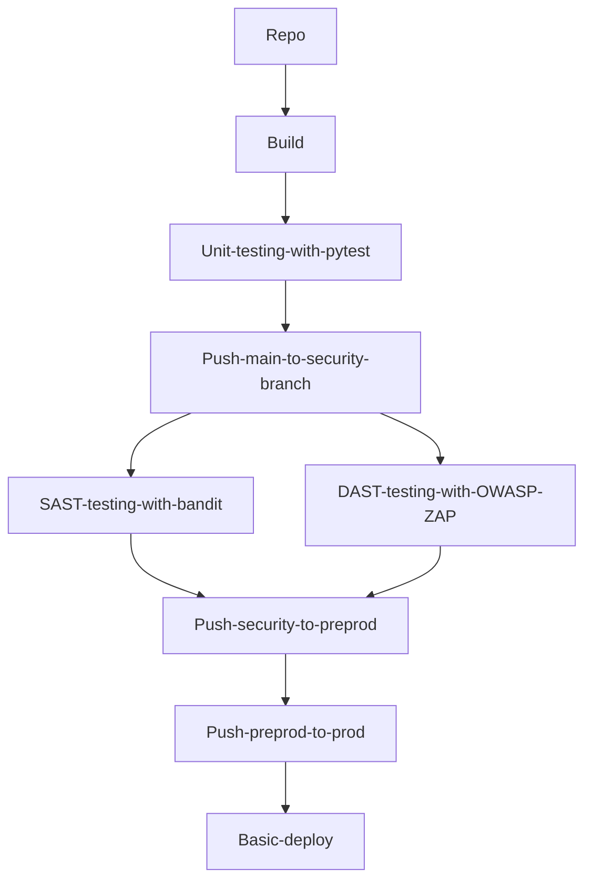
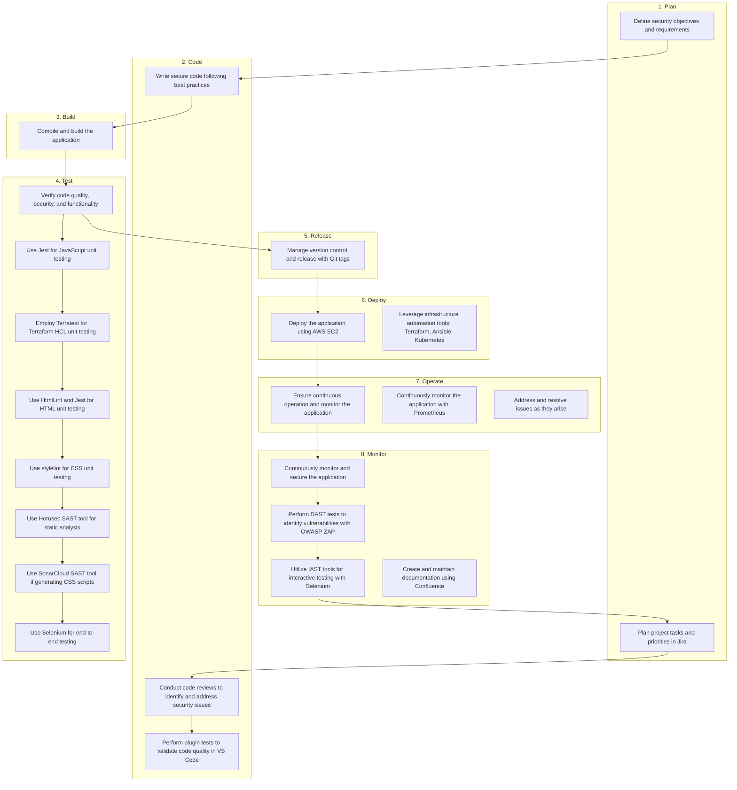

# Flashlearn Website
Developing an MVP involves crafting a minimal yet functional frontend, prioritizing key user interactions. Iterative development and feedback refinement drive this process. Uploading the frontend to GitHub repository facilitates collaboration, version control, and further enhancements.

> "You’re selling the vision and delivering the minimum feature set to visionaries, not everyone." - Steve Blank


## GitHub Workflow Overview

This GitHub Actions workflow automates the DevSecOps lifecycle for our application. It consists of several phases, each performing specific tasks related to security, testing, and deployment. Here's an overview of the key points:

## 1. Build

- **Objective:** Merge and build the code to identify conflicts and ensure successful integration.
- **Tools:** GitHub Actions, Python.

## 2. Unit Testing with Pytest

- **Objective:** Perform unit testing to validate code quality, identify common errors, and generate a test report.
- **Tools:** GitHub Actions, Pytest.

## 3. Push Main to Security Branch

- **Objective:** Create and push code to the "security" branch for security checks.
- **Tools:** GitHub Actions, Git.

## 4. SAST Testing with Bandit

- **Objective:** Perform Static Application Security Testing (SAST) using Bandit to detect common security errors.
- **Tools:** GitHub Actions, Bandit.

## 5. DAST Testing with OWASP ZAP

- **Objective:** Perform Dynamic Application Security Testing (DAST) using OWASP ZAP to find vulnerabilities in the web application.
- **Tools:** GitHub Actions, OWASP ZAP.

## 6. Push Security to Preprod

- **Objective:** Push the secured code to the "preprod" branch.
- **Tools:** GitHub Actions, Git.

## 7. Push Preprod to Prod

- **Objective:** Push the preproduction code to the "prod" branch to make it production-ready.
- **Tools:** GitHub Actions, Git.



This GitHub Actions workflow automates the DevSecOps lifecycle, ensuring that code is built, tested, and secured before deployment to production. It leverages various tools and security checks at different stages to enhance the security and reliability of your application.


# DevSecOps Lifecycle

## 1. Plan

**Objective:** Establish security objectives, requirements, and project planning.

**Activities:**
- Define security requirements and objectives for the application.
- Plan project tasks and priorities.

**Tools:**
- Jira (Issue tracking, project management, and planning).

**GitHub Workflow:** Issue and Project Management.

## 2. Code

**Objective:** Write secure code and ensure quality.

**Activities:**
- Write secure code following best practices.
- Conduct code reviews to identify and address security issues.
- Perform plugin tests to validate code quality.

**Tools:**
- Visual Studio Code (VSCode).
- Code review tools (e.g., GitHub's code review features).

**GitHub Workflow:** Code Review and Pull Requests.

## 3. Build

**Objective:** Compile and build the application.

**GitHub Workflow:** N/A (Build steps might be part of CI/CD pipelines).

## 4. Test

**Objective:** Verify code quality, security, and functionality.

**Activities:**

### Unit Testing

- **JavaScript:** Use **Jest** for JavaScript unit testing.
- **Terraform HCL:** Employ **Terratest** for Terraform HCL unit testing.
- **HTML:** Use **HtmlLint** and **Jest** for HTML unit testing.
- **CSS:** Use **stylelint** for CSS unit testing.

### Static Application Security Testing (SAST)

- **JavaScript, HTML, Terraform, Python:** Use **Horusec SAST tool** for static analysis.
- **CSS:** Use **SonarCloud SAST tool** if generating CSS scripts.

### Selenium Testing

- Use **Selenium** for end-to-end testing of web applications.

**Tools:**
- Jest
- Terratest
- HtmlLint
- stylelint
- Horusec SAST tool
- SonarCloud SAST tool
- Selenium

**GitHub Workflow:** Continuous Integration (CI).

## 5. Release

**Objective:** Manage version control and release of the application.

**Activities:**
- Use Git tags for version control and release management.

**Tools:**
- Git

**GitHub Workflow:** Version Control and Release Management.

## 6. Deploy

**Objective:** Deploy the application.

**Activities:**
- Deploy the application using tools like AWS EC2.
- Leverage infrastructure automation tools like Terraform, Ansible, and Kubernetes for deployment.

**Tools:**
- AWS EC2
- Terraform
- Ansible
- Kubernetes

**GitHub Workflow:** Deployment.

## 7. Monitor

**Objective:** Continuously monitor and secure the application.

**Activities:**
- Continuously monitor the application.
- Address and resolve issues as they arise.

**Tools:**
- Monitoring tools (e.g., Prometheus).
- Automated security monitoring and response tools.
- Cloudtrail (For logging user activities)
- Cloudwatch (for setting alarms on high resource usage)

**GitHub Workflow:** Operations and Monitoring.

## 8. Operate

**Objective:** Ensure the continuous operation and monitoring of the application.

**Activities:**
- Grafana labs (for visualization)
- Google analytics 4 (for operations)

### Dynamic Application Security Testing (DAST)

- Perform DAST tests to identify vulnerabilities.

### Interactive Application Security Testing (IAST)

- Utilize IAST tools for interactive testing.

**Tools:**
- DAST tools (e.g., OWASP ZAP).
- IAST tools (e.g., Selenium).

**GitHub Workflow:** Security Testing and Monitoring.

### Documentation

**Objective:** Create and maintain documentation.

**Activities:**
- Use Confluence for documentation and collaboration among team members.

**Tools:**
- Confluence

**GitHub Workflow:** Documentation and Collaboration.



## Modules to Download

Before you begin, make sure you have the necessary Python modules and dependencies installed:

- Flask
- spacy
- requests
 and others
You can install these modules using `pip`:

```bash
pip install -r requirements.txt
```
## Download the files in the repo

It is advisable to download all the files into a separate folder as the templates and static folder interact with the flask code in the app.py file

## Run the Flask application

```bash
python app.py
```
The development server will start, and you will see output indicating that the server is running.

## Open a web browser and navigate to

```Link:
http://127.0.0.1:3000/
```

[Localhost URL](http://127.0.0.1:3000/)

If your using the docker container, use the link

## For the docker container

Build the Docker container:
```bash
docker build -t my-flask-app .
```
Run the Docker container:
```bash
docker run -p 3000:3000 my-flask-app
```
And for the link:

Access the application at:
```Link:
http://localhost:3000/
```
[Localhost URL](http://localhost:3000/)

These commands build a Docker container for a Flask web application and run it on port 3000, making the application accessible at http://localhost:3000/.

## After the site is open

You should see the "Flashcard Generator" web application.

Enter a sentence into the input field and click the "Generate Flashcards" button. This will trigger the image download and flashcard generation process.

The generated flashcards with images and the entered sentence will be displayed on the web page.

## How to create requirements.txt for python packages

Go to the command prompt in the directory with the app files:

```bash
pip freeze > requirements.txt
```

## To see the software versions installed in your system

Run the Software_versions_script.bat file. It will create a text file that states the software versions used in your system. You can compare it with the DeveloperSoftwareversion.txt file which is present in the Software versions folder if there any version compatability issues. The SoftwareVersions.txt file is under .gitignore so you can run it on the same folder without any issues.
